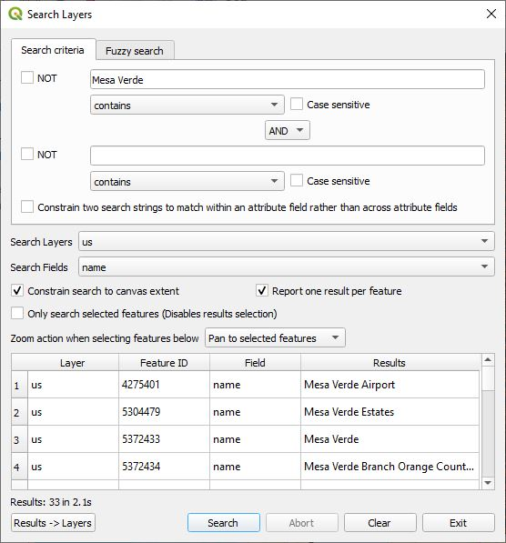
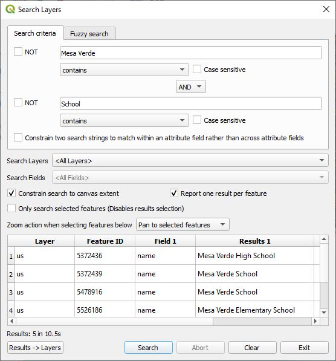

# Search Layers Plugin

The Search Layers plugin features enhanced textual vector layer searching in QGIS. It provides the ability to search across all layers and all fields.

Search Layers is located in the QGIS Plugins menu under *"Plugins->Search Layers->Search Layers"* or by selecting the tool bar icon. 

The following dialog box is displayed when "Search Layers" is launched.

Under **Search criteria**, you can enter up to two search strings. The **NOT** check box will negate the search results for the applicable string.

Under each search string text box a drop down menu specifies how the search string is to match the contents in the attribute table. The options are: 

* **equals** - This requires an exact match.
* **contains** - This looks for a field that contains the search string.
* **begins with** - This search finds any field that begins with the search string.
* **ends with** - This search finds any field that ends with the search string.

By default the search is case independent, but by checking the **Case sensitive** check box the search string must match the case of the text.

**Search Layers** specifies whether the search will be on *&lt;All Layers&gt;*, *&lt;Selected layers&gt;*, or on any of the vector layers in the QGIS project. If a specific layer is selected then **Search Fields** will be enabled and by default *&lt;All Fields&gt;* will be selected, but any field can be selected from the layer and the search will only search on that layer and field.

It is possible that a search string could match the contents in one or more attribute fields. By checking **Report one result per feature**, only the first match per feature will be reported.

When two search strings are used checking **Constrain two search strings to match within an attribute field rather than across attribute fields** will constrain the search criteria to match within an attribute field; otherwise, one string may match one attribute field and the other string may match another attribute field. The results are either **AND**ed or **OR**ed together. Here is an axample of a two string search.

Click  the **Search** button to begin the search. In the case of a large data set, clicking on **Abort** will halt the process. Note that the plugin stops after finding 1500 matches.

When matches are found and clicked on the feature(s) will be highlighted. You can you Shift->Click to highlight a range of features, Ctrl->Click to toggle whether a feature is highlighted or not. The drop down menu **Action when selecting features below** controls one of the following motion actions. 

* **Do nothing** - No action takes place.
* **Zoom to selected features** - QGIS will zoom in on the selected features.
* **Pan to selected features** - QGIS will pan to the selected features.

Note that the search is very quick when selecting a single vector layer under **Search Layers** and a single field under **Search Fields**. If this is not the case regular expression searches are used and are very slow. In the future this may change.
